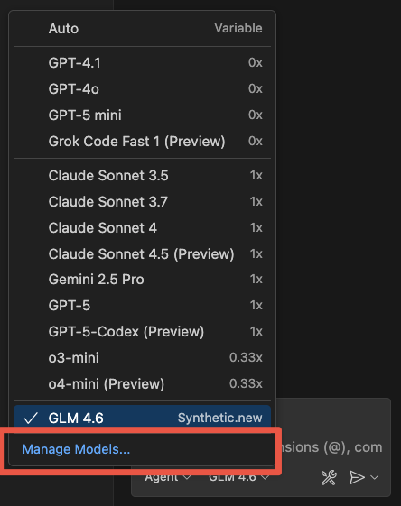
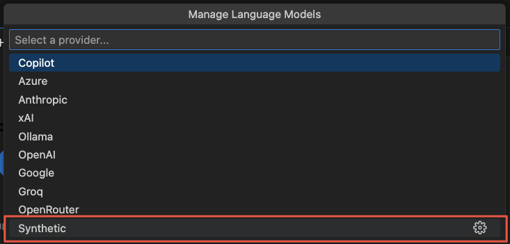
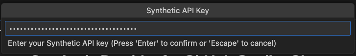
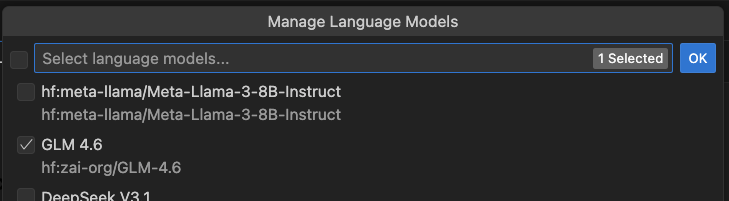

> **Special thanks to [@mcowger](https://github.com/mcowger) for creating this project!**

# [Synthetic](https://synthetic.new) Provider for GitHub Copilot

Use your [Synthetic](https://synthetic.new/) account with Github Copilot in VS Code!

Use Synthetic to chat with thousands of open-weight [models](https://dev.synthetic.new/docs/api/models), including over 20 always-on frontier models, such as [GLM 4.6](https://synthetic.new/hf/zai-org/GLM-4.6), deepseek-ai/DeepSeek-V3.1-Terminus, and [Kimi K2 0905](https://synthetic.new/hf/moonshotai/Kimi-K2-Instruct-0905).


## ⚡ Quick Start
1. Install the [Github Copilot Chat](https://marketplace.visualstudio.com/items?itemName=GitHub.copilot-chat) extension.
1. Install the [Synthetic Provide for Github Copilot](https://marketplace.visualstudio.com/items?itemName=SyntheticLab.synthetic-copilot-provider) extension.
1. Open the Github Copilot Chat interface.
   - **Windows/Linux** default: <kbd>Ctrl</kbd> + <kbd>Alt</kbd> + <kbd>I</kbd>
   - **Mac** default: <kbd>Cmd</kbd> + <kbd>Ctrl</kbd> + <kbd>I</kbd>
   - or: View > Chat
1. Click the model picker and click "Manage Models...".

   

1. Select "Synthetic" provider.

   

1. Provide your Synthetic API Token. (Get yours here: https://synthetic.new/user-settings/api)

   

1. Choose the models you want to add to the model picker. 🥳

    


## 🛠️ Development

```bash
git clone https://github.com/synthetic-lab/synthetic-vscode-chat.git

cd synthetic-vscode-chat

npm run package

# Ctrl+Shift+P / Cmd+Shift+P > "Extensions: Install from VSIX" OR
code --install-extension synthetic-vscode-chat.vsix
```
